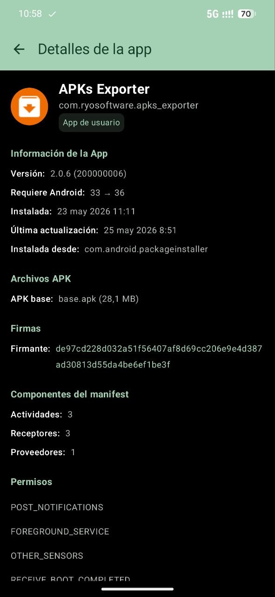
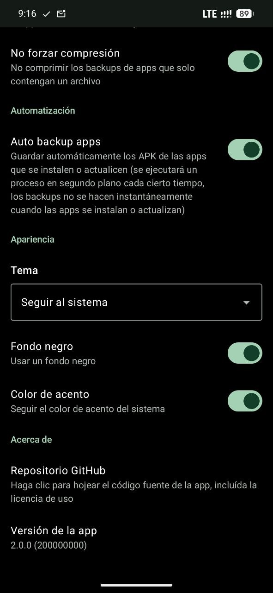

<div align="center">
  

  # APKs Exporter

  **Backup, export, and manage APK files from your installed Android apps**

  [](https://creativecommons.org/licenses/by-nc-sa/4.0/)
  [](https://developer.android.com/about/versions/13/features)
  [](https://developer.android.com/about/versions/16/features)
  [](https://kotlinlang.org)
  [](https://developer.android.com/jetpack/compose)
  [](https://github.com/ryosoftware/apks-exporter/releases)
  [](https://github.com/ryosoftware/apks-exporter/stargazers)

  [Download](#-download) • [Features](#-features) • [Screenshots](#-screenshots) • [Usage](#-usage) • [Privacy](#-privacy) • [License](#-license)
</div>

---

## 📥 Download

Get the latest APK from the [Releases page](https://github.com/ryosoftware/apks-exporter/releases).

> **Requires Android 13 (API 33) or higher.**

---

## 🚀 Features

- **📦 Export APKs** from any installed user or system app
- **🧩 Split APK support** — handles multi-apk apps (Android App Bundle / Split APKs)
- **📂 Multiple export formats** — save as individual `.apk` files or compressed `.zip`
- **🔄 Batch export** — select and export multiple apps at once
- **🤖 Auto-backup** — automatically backup APKs when apps are installed or updated
- **📋 Extended app info** — view permissions, signatures, manifest components, special permissions, and more
- **📤 Share APKs** — share apps directly from the app
- **⚡ Install/uninstall apps** — install APKs (including zip archives with split APKs) and uninstall apps
- **🔒 No internet permission** — your data never leaves your device
- **🎨 Modern UI** — built with Kotlin + Jetpack Compose + Material 3
- **🌙 Theme support** — dark/light/system theme with pure black OLED mode and system accent color
- **🔍 Search & filter** — quickly find apps by name
- **🌎 Spanish & English** — fully translated UI
- **🆓 Free & Open Source** — no ads, no tracking, no nonsense

---

## 📸 Screenshots

<p float="left">
  
  
  
  
  
</p>

---

## 🛠 Tech Stack

| Layer | Technology |
|-------|-----------|
| Language | [Kotlin](https://kotlinlang.org/) |
| UI | [Jetpack Compose](https://developer.android.com/jetpack/compose) + [Material 3](https://m3.material.io/) |
| Architecture | MVVM (ViewModel + StateFlow) |
| Background work | [WorkManager](https://developer.android.com/topic/libraries/architecture/workmanager) |
| Persistence | [DataStore Preferences](https://developer.android.com/topic/libraries/architecture/datastore) |
| Min / Target SDK | Android 13 (API 33) / Android 16 (API 36) |

---

## 🔐 Privacy

**APKs Exporter does NOT request internet permission.**
Your app data is extracted and stored locally on your device.
No data is ever sent to any server.
The app only requires:

- Storage access (to save exported APKs)
- Package querying (to list installed apps)
- Notification permission (for auto-backup status)
- Boot receiver (to reschedule auto-backup after reboot)

---

## 📄 Usage

1. **Select a save folder** — go to Settings → Save folder
2. **Browse your apps** — the main screen lists all installed apps (user and optional system apps)
3. **Tap an app** for options: share, install, uninstall, or view details
4. **Long-press** to select multiple apps for batch export
5. **Enable Auto-backup** in Settings to automatically save APKs on install/update

### Backup filename format

You can customize the output filename structure in Settings:
- Use **app label** or **package name**
- Use **long version** or **short version code**
- Save as **single ZIP** or **folder structure** (for multi-apk apps)

---

## ✅ Certificate Signature Verification

The SHA-256 digest of the certificate used to sign the app remains constant across all versions:

```
de97cd228d032a51f56407af8d69cc206e9e4d387ad30813d55da4be6ef1be3f
```

Verify with:

```shell
apksigner verify --verbose --print-certs app-release.apk | grep "Signer #1 certificate SHA-256 digest"
```

---

## 🤝 Contributing

Contributions, issues, and feature requests are welcome! Feel free to:

- [Open an issue](https://github.com/ryosoftware/apks-exporter/issues)
- [Submit a pull request](https://github.com/ryosoftware/apks-exporter/pulls)

---

## 📄 License

This project is licensed under the **CC BY-NC-SA 4.0** License — see the [LICENSE](LICENSE.md) file for details.

[](https://creativecommons.org/licenses/by-nc-sa/4.0/)

---

<div align="center">
  Made with ❤️ by <a href="https://github.com/ryosoftware">RyO Software</a>
</div>
